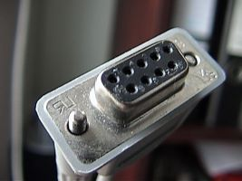
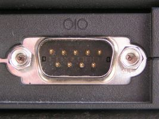

# Les liaisons séries - La norme RS-232

## C'est quoi, la norme RS-232 ?

La RS-232 est une norme de communication série introduite dans les années 1960. À l'époque, les ordinateurs et leurs périphériques (comme les imprimantes ou les modems) avaient besoin d'une méthode efficace pour communiquer, même s'ils étaient de modèles différents. La RS-232 a été créée pour standardiser cette communication, devenant ainsi une sorte de langue commune pour les machines. Elle définit tout : la vitesse de transmission des données, les types de câbles à utiliser, et même la forme des connecteurs.

## Comment ça marche ?

La norme RS-232 utilise un système de communication série asynchrone, où les données sont transmises bit par bit sur un seul fil. Pour que les deux appareils se comprennent, ils doivent suivre certaines règles strictes, un peu comme un code de conduite. Voici les éléments clés :

1. **Tension électrique** : La RS-232 utilise des niveaux de tension spécifiques pour représenter les bits. Par exemple, une tension comprise entre -3 et -15 volts représente un bit logique 1 (appelé "marque"), tandis qu'une tension comprise entre +3 et +15 volts représente un bit logique 0 (appelé "espace"). Ces tensions sont inversées par rapport aux normes plus récentes, ce qui peut surprendre ceux habitués à des systèmes comme l'USB.

|                             | Niveau logique 0 | Niveau logique 1 |
| --------------------------- | ---------------- | ---------------- |
| Tension électrique minimale | +3V              | -3V              |
| Tension électrique maximale | +25V             | -25V             |

2. **Bits de démarrage et d'arrêt** : Pour signaler le début de la transmission d’un octet, le périphérique envoie un bit de démarrage, qui est toujours un 0 (tension positive). À la fin de l’octet, un ou plusieurs bits d’arrêt sont envoyés, qui sont toujours des 1 (tension négative). Ces bits servent à synchroniser les deux appareils pour qu'ils sachent quand les données commencent et se terminent.

3. **Baud rate** : Le baud rate est la vitesse à laquelle les bits sont transmis, mesurée en bits par seconde (bps). Par exemple, un baud rate de 9600 signifie que 9600 bits sont envoyés chaque seconde. La principale contrainte pour définir le baud rate est la longueur du câble séparant les deux appareils. Les deux appareils doivent être configurés avec le même baud rate pour que la communication fonctionne correctement.

| Débit en bit/s | Longueur du câble en mètres (m) |
| -------------- | ------------------------------- |
| 2 400          | 900                             |
| 4 800          | 300                             |
| 9 600          | 150                             |
| 19 200         | 15                              |

4. **Parité et contrôle d'erreur** : La RS-232 permet d'ajouter un bit de parité pour vérifier si les données ont été transmises correctement. C’est un peu comme une double vérification : si le nombre de bits 1 dans l’octet est pair (ou impair, selon la configuration), l’émetteur enverra un bit de parité correspondant pour s'assurer que l'autre appareil peut détecter d'éventuelles erreurs.

5. **Signaux de contrôle** : En plus des données, la RS-232 utilise des signaux de contrôle, comme RTS (Request to Send) et CTS (Clear to Send), qui permettent aux appareils de coordonner leur communication. Par exemple, avant d’envoyer des données, l’émetteur peut vérifier que le récepteur est prêt en utilisant ces signaux.

En résumé, la RS-232 est un protocole méthodique où chaque étape est bien définie pour assurer que les données sont transmises de manière fiable et sans confusion. Bien que simple, ce protocole reste efficace et continue d'être utilisé dans des applications où la stabilité et la clarté de la communication sont cruciales.

## Comment interfacer deux Arduino ?

Utiliser la norme RS-232 avec un Arduino, c'est comme donner à ton microcontrôleur un moyen de discuter avec d'autres appareils plus anciens ou spécialisés. Les Arduino, en général, utilisent un port série (souvent appelé `Serial`) pour communiquer via RS-232, mais il y a un petit hic : l'Arduino fonctionne avec des niveaux de tension TTL (0V pour un 0 logique et 5V pour un 1 logique), alors que la RS-232 utilise des tensions beaucoup plus élevées et inversées. Pour combler cet écart, on utilise un convertisseur de niveau de tension, comme un module MAX232. Ce composant magique transforme les signaux TTL de l'Arduino en signaux RS-232 compatibles, et vice versa.

Il est également possible d'interfacer deux Arduino via leurs ports `Serial`, mais attention, dans ce cas, ils n'utilisent pas la norme RS-232.

[Dans les TP suivants, nous allons émuler le port série sur PC pour faire communiquer un Arduino avec l'ordinateur.](./TP%20guidé.md)
