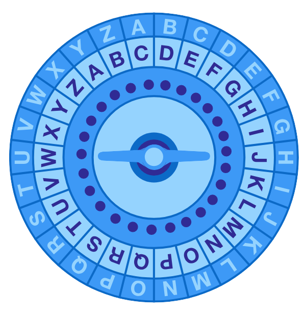

# Les liaisons séries - TP - Le code de César

## Conseils

-   Munissez vous d'une feuille de papier et d'un crayon pour comprendre comment le code de César fonctionne avant de vous lancez dans le code.
-   Lisez le TP en entier avant de commencer.
-   Commentez votre code et utilisez des noms de variables ayant du sens !
-   Utilisez Tinkercad pour tester votre code. Une fois que tout fonctionne, copier/coller votre code dans un fichier :
    -   Pour la partie 1, mettez votre code dans le fichier `TP Code César partie 1.c`.
    -   De même pour la partie 2, dans le fichier `TP Code César partie 2.c`

## Enoncé

Le but de cet exercice est de transformer notre Arduino en codeur/décodeur de message en utilisant une version modifiée de la méthode de César. Le chiffrement de César est un procédé cryptographique qui permet de coder un message. Chaque lettre de la chaîne de caractères formant le message est remplacée par une autre. La **clé** est un nombre entier entre 1 et 25 qui indique le décalage de l'alphabet nécessaire pour chiffrer ou déchiffrer le message.

Pour chiffrer un message, chaque lettre est remplacée par la n-ième lettre qui la suit dans l'alphabet. Par exemple pour une clé de `6` : `a` devient `g`, `b` devient `h`, `c` devient `i` et ainsi de suite jusqu'à `z` qui devient `f`.

<center>



</center>

Le message `bonjour` avec une clé de `6` devient alors le message chiffré : `hutpuax`

Pour déchiffrer un message, on opère de façon inverse, chaque caractère du message est remplacé par le nième caractère précédent dans l'alphabet. Par exemple, avec une clé de 8 et le message chiffré suivant : `qtvmqom` après déchiffrage on obtient `ilneige`.

> Pour qu'un message soit valide, il ne doit contenir ni espace, ni majuscule, ni caractères spéciaux.

## Partie 1

1. Écrivez la fonction `setup()`.
2. Définissez une variable globale `key` correspondant à la clé. On la fixe à la valeur `6`.
3. Dans la fonction `loop()` :
    1. Récupérez le premier caractère du buffer.
    2. Ajoutez-y la valeur de la clé.
    3. Affichez le résultat.
    4. Pour l'exemple `hello` vous devez obtenir `nkrru`.
4. Que se passe-t-il si le message est `bonjour` ? Proposez une amélioration de votre code permettant d'obtenir un message chiffré correctement.

```C++
int key = 6;

void setup()
{
  Serial.begin(9600);
  String variable = "hello";
  Serial.println(variable);
}

void loop()
{
    int readChar = 0;
    int buff = Serial.available();
    while (buff > 0);
    {
        readChar = Serial.read() + key;
        char text = readChar;
    	if (readChar > 'z');
 		{
          text = readChar - 26;
        }
        Serial.print(text);
      	buff = Serial.available();
	}
}
```

## Partie 2

Notre code ne permet pas de choisir si l'on veut chiffrer ou déchiffrer un message ni de paramétrer la valeur de la clé. Rendons les choses un peu plus complexes pour que notre Arduino puisse prendre en compte ces deux aspects.

Désormais, un message envoyé à l'Arduino aura le format suivant : `0,6,bonjour`.

-   Le premier nombre correspond au type d'opération que l'Arduino doit effectuer :
    -   `0` : le message doit être chiffré
    -   `1` : le message doit être déchiffré
-   Le deuxième nombre correspond à la clé. Dans l'exemple ci-dessus la clé vaut `6`. Attention, une clé peut être sur deux chiffre, exemple : `20`.
-   La troisième partie contient le message chiffré ou déchiffré qui doit toujours être sans espace, sans majuscule et sans caractères spéciaux.

Exemple :

-   Pour le message : `0,6,bonjour` l'Arduino doit afficher `hutpuax`.
-   Et pour le message : `1,12,mgvagdptguuxrmufnqmg` il doit afficher `aujourdhuiilfaitbeau`

1. Définissez une variable globale `operation` qui stockera le premier nombre du message.
2. Créez deux fonctions : `chiffrement()` et `dechiffrement()`.
    1. Ces fonctions ont-elles besoin d'arguments ? Quelles informations doit-on leur fournir pour qu'elles réalisent leur tâche ?
    2. Faut-il ajouter un type de retour ?
3. Dans la fonction `loop()`
    1. Proposez une façon d'enregistrer les informations reçues par l'Arduino dans une structure de données complexe (tableau ou chaîne de caractères par exemple).
    2. Segmentez les données reçues et affectez leurs valeurs à `key` et `operation`.
    3. Appelez `chiffrement()` et `dechiffrement()` dans les situations qui conviennent.
4. Testez votre code.
```C++
int key = 6;

void setup()
{
  Serial.begin(9600);
  int variable = '0';
  char caractere = variable + 0;
  Serial.println(caractere);
  char u = variable + key;
  Serial.println(u);
  Serial.print(variable);
}
void loop()
{
    char readChar = 0;
    int buff = Serial.available();
    String variable = "";
    int i;

    while (buff > 0);
    {
        readChar = Serial.read();
        variable = variable + readChar;
        buff = Serial.available();
    }
 	for (int i = 0; i < 1; i++);
 	{
      if (variable[i] >= 'u');
 	  {
    	 variable[i] = variable[i] - 26;
 	  }
 	  variable[i] = variable[i] + key;
	}
}
```

## Bonus

Sécurisez votre code afin qu'il ne s'exécute que dans des situations valides. Exemple : valeur d'opération invalide, valeur de clé invalide, message contenant des caractères interdits.

Une fois ce TP terminé, vous pouvez passer au suivant : [TP - Niveaux de la machine à café](./TP%20machine%20à%20café.md)
