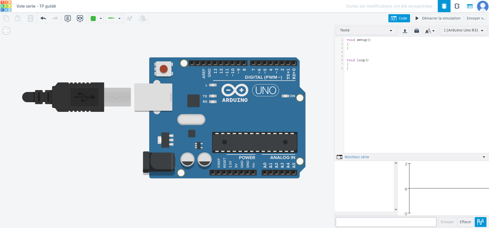

# Les liaisons séries - TP guidé - Envoi et réception de données

## Mise en place

Pour ce TP, rendez-vous sur [Tinkercad](https://www.tinkercad.com/) et placer un Arduino UNO R3. Le volet dépliant "Moniteur série" va nous permettre d'envoyer des messages depuis notre PC en passant par le port série et de recevoir les messages de notre Arduino.



Pour le moment, il n'est pas possible d'utiliser le moniteur de série, il faut d'abord initialiser la communication. Pour cela, on utilise l'objet `Serial`.

## L'objet _Serial_

L'objet Serial dans l'IDE Arduino est essentiel pour la communication série entre l'Arduino et un ordinateur ou un autre appareil série. Voici quelques méthodes utiles :

-   `Serial.begin(speed)` : Initialise la communication série avec la vitesse spécifiée en bits par seconde. Exemple : Serial.begin(9600); pour une vitesse de 9600 bps (Attention : les bauds sont un nombre d'octet par seconde; 9600 bps = 1200 bauds).

-   `Serial.end()` : Termine la communication série et libère les ressources associées.

-   `Serial.print(data)` : Envoie les données à la liaison série sous forme de texte sans saut de ligne à la fin. Les données peuvent être de différents types (chaînes de caractères, nombres, etc.).

-   `Serial.println(data)` : Envoie les données à la liaison série sous forme de texte suivi d'un saut de ligne, ce qui facilite la lecture de plusieurs lignes de données.

-   `Serial.read()` : Lit un octet de données de la liaison série. Retourne -1 si aucune donnée n'est disponible.

-   `Serial.available()` : Retourne le nombre de bytes disponibles pour la lecture dans le buffer série.

-   `Serial.peek()` : Lit le prochain byte disponible dans le buffer sans le retirer du buffer.

-   `Serial.flush()` : Vide le buffer de sortie, s'assurant que tous les caractères ont été transmis avant de continuer.

## 1. Initialisation de la communication

La fonction `begin()` permet l'établissement de la communication entre notre PC et l'Arduino. Comme paramètre de vitesse, on va prendre 9 600 bps qui est une vitesse de transmission standard.

voici le code pour Tinkercad :

```C++
void setup()
{
    // ouverture de la liaison à une vitesse de 9600 bits par seconde.
    Serial.begin(9600);
}
```

## 2. Envoi de données

Pour envoyer des données, on va utiliser les fonctions `print()` et `println()`. Normalement, elles doivent vous rappeler quelque chose car ce sont les mêmes fonctions qu'en C++ ! Un petit exemple de leur utilisation :

```C++
void setup()
{
    // ...
    Serial.print("Ceci est un message sur une ligne. ");
    Serial.println("Ceci est un message sur la meme ligne.");
    Serial.println("Ceci est un message sur une deuxieme ligne.");
}
```

Pour rappel, les caractères sont stockés sous forme de nombre dans la mémoire. La correspondance entre un caractère et sa valeur se fait en utilisant la table ASCII.

<center>


</center>

> Ainsi, pour le caractère 'A' c'est la valeur 65 qui est enregistré. Que va afficher l'extrait de code suivant ?

```C++
int variable = 'A';
char caractere = variable + 1;
Serial.println(caractere);
```

## 3. Exercice envoi de données

En utilisant le moins d'instructions possible, ecrivez un algorithme qui permet d'afficher les 26 lettres de l'alphabet en majuscule et en minuscule de la façon suivante :

```
AaBbCc...Zz
```

> Inserez ici votre code, il doit être dans un codebloc (entre triple reverse quote ```) balisé avec le langage C++.

```C++
  Serial.begin(9600);
  for(int i=0;i<26;i++){
    char caractere = 'A'+ i;
    char caracteremin = 'a' + i;
    Serial.print(caractere);
    Serial.print(caracteremin);}
```

## 4. Réception de données

Les données reçu par l'Arduino sont stockées dans un buffer, une sorte de file d'attente de caractère. Pour le consulter, on utilise la fonction `available()` qui retourne le nombre de caractères présents dans le buffer. Si le buffer est vide, la fonction retourne -1.

```C++
void loop()
{
    int buffer = Serial.available();
    if(buffer > 0) // si le buffer n'est pas vide
    {
        // Traitement
    }
}
```

Pour lire les données, on utilise la fonction `read()`. Elle retourne le premier caractère de la file d'attente. Une fois que celui-ci a été lu, il est retiré du buffer. Ce fonctionnement est appelé FIFO : First In First Out.

Exemple d'utilisation de la fonction `read()` :

```C++
void loop()
{
    char buff = Serial.read();

    if(buff != -1)
    {
        // traitement lorsque le buffer n'est pas vide
    }
    else
    {
        // traitement lorsque le buffer est vide
    }
}
```

## 5. Exemple de renvoi de données reçu

Avant de vous laisser faire le premier TP en autonomie, un exemple de code complet. Cet algorithme envoie sur la voie série les données reçu sur la voie série.

```C++
void setup()
{
    Serial.begin(9600);
}

void loop()
{
    char readChar = 0; // caractère à lire

    int buff = Serial.available();

    while(buff > 0) // tant qu'il reste des caractères dans le buffer
    {
        readChar = Serial.read(); // lecture du caractère
        Serial.print(readChar); // envoi du caractère
        buff = Serial.available(); // mise à jour du nombre de caratères restant
    }
}
```

Si cet exemple est clair, vous pouvez passer au [TP suivant](./TP%20Code%20César.md).
